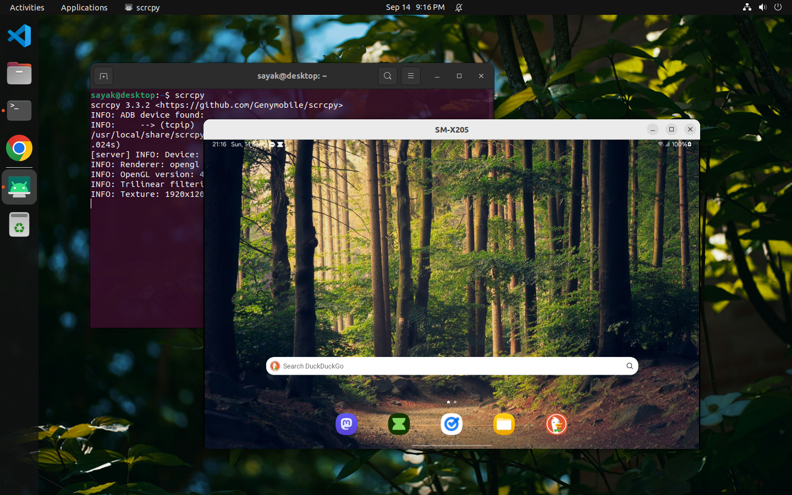

<pre>
Hello World 

Today I thought to wirelessly connect my android tablet & desktop and mirror it via scripy and here's how I did it

		-------------------
		Terminal to Android
		-------------------
		
 First Connect via USB,

# Step 1

	Android Device --> Desktop (Ubuntu-Linux)
	'
	'--> Settings
	'--> About Tablet
	'--> Software information
	'--> Build Number (Tap 7 times - Developer Options On)
	'--> Turn On USB Debbuging (Inside Developer Option)

* Issue 1 -> it got greyed out & can't able enable, 

	<a href="https://stackoverflow.com/a/78677671/31488100">https://stackoverflow.com/a/78677671/31488100</a>

	It got solved

# Step 2

	Desktop (Ubuntu-Linux)
	'
	'--> Open terminal
	'--> sudo apt install adb (If not installed)
	'--> adb tcpip 5555
	'--> adb connect [IP Address (Android Device)]:5555
	
	Connected Wirelessly Now can remove the USB connection 

* Issue 2 - How to find the IP Address on Android Device ?

	Android Device
	'
	'--> Settings
	'--> About Tablet
	'--> Status information (ex, 192.168.1.1)

	Found It

# Step 3

	Desktop (Ubuntu-Linux)
	'
	'--> Open terminal
	
* Issue 3 - How to mirror it ?

	Have to install scrcpy

	<a href="https://github.com/Genymobile/scrcpy/blob/master/doc/linux.md">Followed the # for Debian/Ubuntu </a>

	Finally Downloaded

	'--> scrcpy (On Desktop terminal)

	

  
	

FINALLY DID IT...

	* Additional Issue - 
	After shutdown when I relogin and try to connect via 'scrcpy' got this error
	
	$ scrcpy 3.3.2 <https://github.com/Genymobile/scrcpy>
	  * daemon not running; starting now at tcp:5037
	  * daemon started successfully
	  ERROR: Could not find any ADB device
	  ERROR: Server connection failed

	'
	'-->  adb connect [IP Address (Android Device)]:5555

		Problem Solved
</pre>

